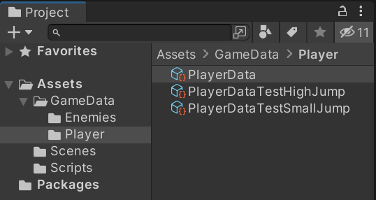
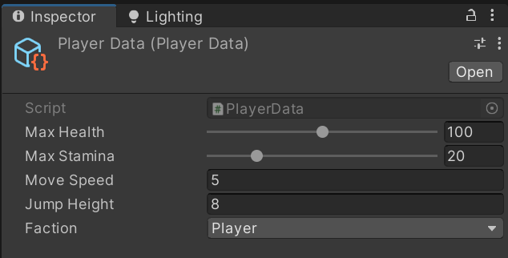
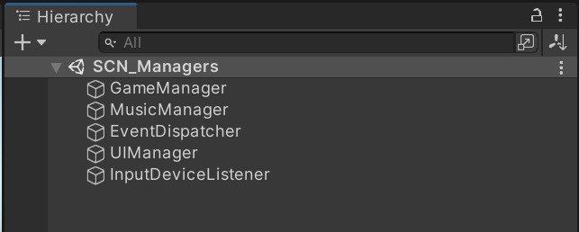
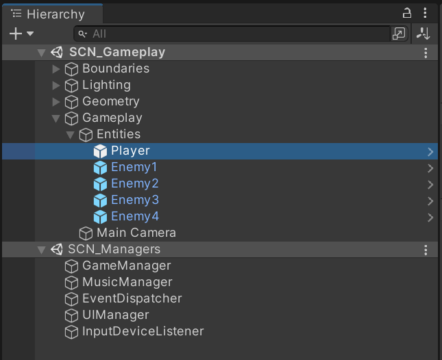
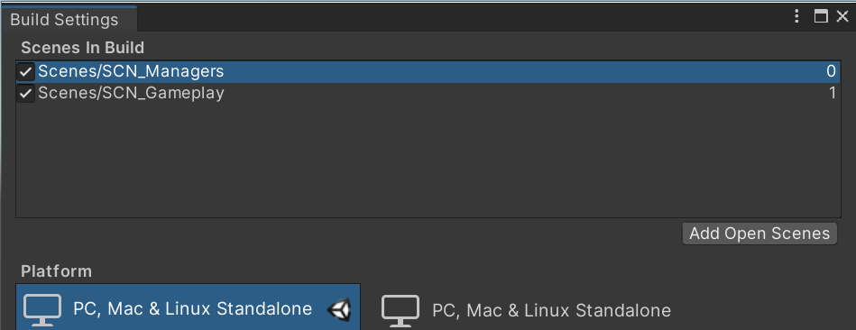
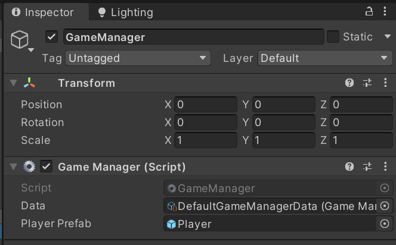
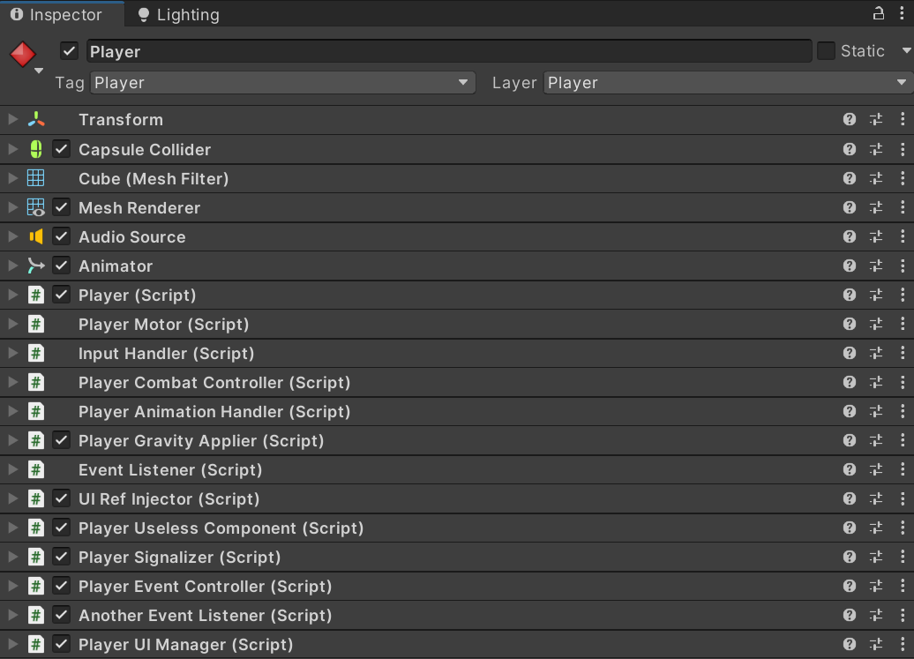
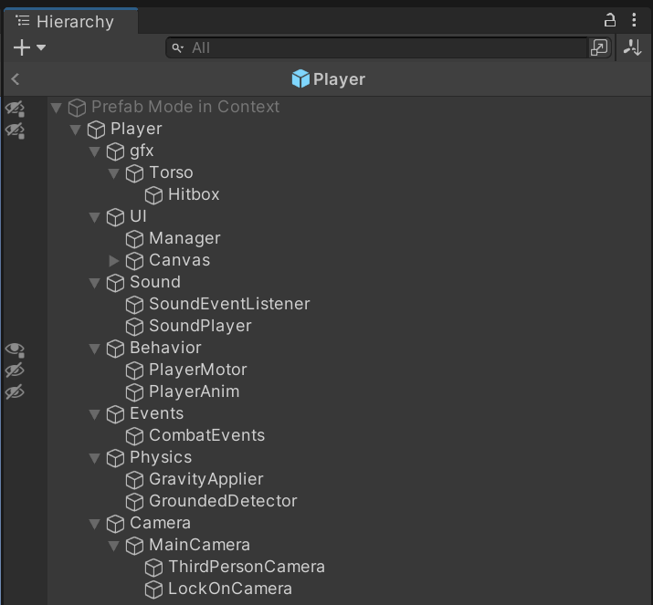
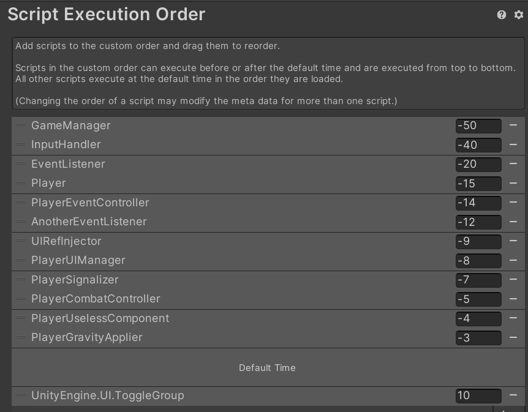
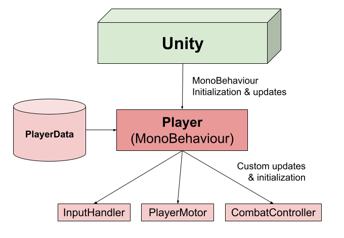

# Unity: 5 coding tips to deliver NEW FEATURES FASTER


As coders, as much as we want to create perfect systems that would impress even Linus Torvalds, they might not bring **value** to our players. If players don't get value out of our product, they won't use it.

And by value, I mean **content**. I mean **new features**. I mean new mechanics, new levels, new 3D models. Everything that is tangible to players and makes their experience richer.

So we want to find a way deliver these faster, consistently, and be able to minimize bugs while doing that.

> But how can we do that?

We can start by having some general guidelines for our code:

* Less confusion -> Less bugs -> Less fixing -> **More features**
* Less redundancy -> Less conflicts -> Less meetings -> **More features!**
* Smaller batches of work -> Deliver faster & often -> Less testing -> Smaller fixes -> **Even more features!!!**

Now let's put these guidelines to use.

---

## 1. Stop FIGHTING DESIGNERS

There is something we often don't perceive when programming in Unity:

**Scene and Prefab Hierarchy are part of the code.**

MonoBehaviours are bound to GameObjects. We need GameObjects for MonoBehaviours to reference each other. We often make a GameObject a child of another just to communicate component relationship.

Game Designers use the same GameObjects to modify MonoBehaviour data, as they need to test parameters and balance gameplay.
They might also modify prefabs to add new behaviours, or create copies of a prefab on a level.

Both us and the designers are trying to modify the same objects.
This creates merging conflicts in Git, and might cause problems that we have to fix before the designer can continue.

> How do we avoid this?

**ScriptableObjects!**

ScriptableObjects can be used to store non-runtime data used by MonoBehaviours.
And by non-runtime, I mean those values that Game Designers modify to change gameplay parameters.
These values are consistent between plays and generally not modified while the game is running.

The code typically looks like this:

```csharp
public class PlayerData : ScriptableObject
{
    public float MaxHealth
    {
        get => maxHealth;
    }

    public float JumpHeight
    {
        get => jumpHeight;
    }

    // ...

    [SerializeField] private float maxHealth;
    [SerializeField] private float jumpHeight;

    // ...
}
```

On the MonoBehaviour that uses it, we simply add a reference:

```csharp
public class Player : MonoBehaviour
{
    // Serialized data
    [SerializeField] private PlayerData data;

    // Runtime data
    private float health;

    private void Start()
    {
        // Load serialized data
        health = data.MaxHealth;
    }

    private void OnGetHit(float damage)
    {
        // Modify only the runtime data
        health -= damage;
    }

    // ...
}
```

Now we can have instances separated from scenes and at organized folders that Game Designers can mess with:



They can also create multiple instances of the same ScriptableObject and swap out the references to test how each parameter configuration works out.
All the configurations will be safely stored in separate files, and the values will persist between plays!

This greatly reduces merging conflicts when designers are changing values. And even if we have to solve merging conflicts, we deal with way less data.

Look at the .asset file for our ScriptableObject:

```yaml
%YAML 1.1
%TAG !u! tag:unity3d.com,2011:
--- !u!114 &11400000
MonoBehaviour:
  m_ObjectHideFlags: 0
  m_CorrespondingSourceObject: {fileID: 0}
  m_PrefabInstance: {fileID: 0}
  m_PrefabAsset: {fileID: 0}
  m_GameObject: {fileID: 0}
  m_Enabled: 1
  m_EditorHideFlags: 0
  m_Script: {fileID: 11500000, guid: 6dac150ec821c7e4f8240c383d68d586, type: 3}
  m_Name: PlayerData
  m_EditorClassIdentifier: 
  maxHealth: 100   # <----- This is where our data starts!
  maxStamina: 20
  moveSpeed: 5
  jumpHeight: 8
  faction: 0
```

And compare that to the [.prefab file for the Player](https://gist.github.com/leotgo/9e4502bfc1ffe5cff051d74b4de56c41).

It also makes the inspector cleaner for them: now they can focus on the values that are relevant to them, without having to know about references or hierarchies:



---

## 2. PROTECT your Singletons

[Singletons](http://gameprogrammingpatterns.com/singleton.html) are some pretty handy dudes, but Unity seems to hate them.

In most cases, we need to attach our Managers to GameObjects and explicitly tell Unity to not delete them when a scene is unloaded.

* If we end up using many Singletons, they end up cluttering our scene;
* If they reference anything in our scene, those references are lost when the scene is unloaded;
* If they reference assets you can't instantiate them in runtime, and thus you have to make a copy in each scene.

We are **explicitly managing the lifetime** of references in our code, which is a dimensional portal to problems we don't want to deal with.
There's a reason so many C++ developers are bald.

> How do we avoid this?

We can use [Multi-scene editing](https://docs.unity3d.com/Manual/MultiSceneEditing.html) and [Additive Loading](https://docs.unity3d.com/ScriptReference/SceneManagement.LoadSceneMode.Additive.html) to create an isolated "globals" scene, where we keep our managers and singletons.

First, we create a separate scene with our Singletons/Managers:



During development, we can load this scene while editing others and keeping a clean hierarchy for each:



If we keep this scene loaded since application start, we can have our Singletons bound to the lifetime of the application. One way to do this is to have this scene as the first in the build scene order:



Then, we load and unload scenes additively as required:

```csharp
public class GameManager : MonoBehaviour
{
    // Serialized data!
    [SerializeField] private GameManagerData data;

    // References to assets!
    [SerializeField] private GameObject playerPrefab;

    IEnumerator Start()
    {
        yield return new WaitForSeconds(data.StartSceneTime);
        LoadScene(data.StartScene);
    }

    private void LoadScene(int index)
    {
        var current = SceneManager.GetActiveScene().buildIndex;
        SceneManager.LoadScene(index, LoadSceneMode.Additive);
        if(index > data.StartScene)
        {
            SceneManager.UnloadSceneAsync(current);
        }
    }

    // ...
}
```

Now, we don't have to deal with instancing and checking if the reference for a Singleton is valid. We know that if the application is running, the singletons are already loaded in memory and ready to go.

We can also use references to serialized assets with them without worries, as they are always properly serialized in a Scene:



---

## 3. Focus on USES rather than DETAILS

When changing or improving features in our game, we often have to deal with changes in implementations.
Sometimes, these changes will break working components and be a pain in the ass to deal with.

Sometimes we did not make these changes, yet we are still tasked with fixing stuff.
In the worst cases we have to understand cryptic code details from others to make our adaptations.
Even they might not know how it works anymore. Here, we discuss how to avoid that.

Imagine we have a class `PlayerMotor` that handles player movement and has a property named `Speed`:

```csharp
public class PlayerMotor : MonoBehaviour
{
    public float Speed
    {
        get => speed;
    }

    private float speed;

    // ...
}
```

We want to display this value in the UI, so we create a `UISpeedometer` component:

```csharp
public class UISpeedometer : MonoBehaviour
{
    [SerializeField] private PlayerMotor motor;
    [SerializeField] private Text text;
    [SerializeField] private string speedUnit = "m/s";

    private void Update()
    {
        text.text = $"Speed: {motor.Speed} {speedUnit}";
    }
}
```

As we implement new features in our game, we realize that now we want Quake-like movement with complex vectorial operations to handle acceleration, surface friction and gravity. At some point, speed becomes a `Vector3`:

```csharp
public class PlayerMotor : MonoBehaviour
{
    public Vector3 Speed
    {
        get => speed;
    }

    // ...
}
```

Suddenly, our UI displays "Speed: (0.2f, 0.1f, 0.8f) m/s". Surely we don't want the player to perform real time vectorial math!

We could fix that by changing our Speedometer code:

```csharp
public class UISpeedometer : MonoBehaviour
{
    / ...

    private void Update()
    {
        text.text = $"Speed: {motor.Speed.magnitude} {speedUnit}";
    }
}
```

Now it displays correctly, as we still use a floating point number.

However, imagine that we had 12 other UI elements and 5 different enemy AI implementations that used Speed as a float. Some of those components used at least 3 other properties from `PlayerMotor`, which were all changed during our Quake movement implementation. A few changed properties in `PlayerMotor` quickly caused things to spiral out of control, and now we have to fix a ton of components.

While we were fixing all of these, **Junior the "Programming Prodigy"** from our team just finished his ultimate implementation of Quake movement.
Your boss is impressed and gave him a 120% raise, and all the while your UI components and AI agents stopped working again, since he changed all the properties in the `PlayerMotor` class.

Now we have `relativeVel3D_f`, from the `VelocityComposite3D` class. Of course, we also have the `m_fric_speed_x`, `m_fric_speed_y` and `m_fric_speed_z` floats, and even a quaternion named `frameBasedRotationalSpeed_w`.

**... What the hell should we even use?**

---

Let's take a moment to understand what is happening here.

* We as UI implementers need to know details about Junior's `PlayerMotor` implementation to calculate the speed.
* This means that we will spend an insurmountable amount of time understanding his code;
* All the UI and AI classes need to change because of `PlayerMotor`, since what they originally used was that simple float property;
* Since the `PlayerMotor` class exposes a giant public interface to other classes, changes to isolated properties might cause unrelated components to start failing.

The code for all those UI components and AI agents is **heavily coupled** to our implementation of player movement.
Any changes we make to movement will always break something, which makes our code really sensitive and wastes precious time we could use to implement **NEW FEATURES!**

> How can we avoid this?


The first thing we can do is have a fixed public interface that is agnostic to the details of how we implement speed (and any other properties):

```csharp
public interface IPhysicsCharacter
{
    float Speed { get; }
    Rigidbody rigidbody { get; }
}
```

Now, our `PlayerMotor` class is forced to implement the contract defined by our interface:

```csharp
public class PlayerMotor : MonoBehaviour, IPhysicsCharacter
{
    public float Speed
    {
        get => speed.magnitude;
    }

    private Vector3 speed;

    // ...
}
```

Even if our friend **Junior the "Programming Prodigy"** decides to remove or rename "Speed", he still has to keep the public interface working.
UI components or other classes can now simply use the public interface without knowing about the implementation details, since `Speed` is guaranteed to be a `float`:

```csharp
public class UISpeedometer : MonoBehaviour
{
    [SerializeField] private IPhysicsCharacter physicsCharacter;
    [SerializeField] private Text text;
    [SerializeField] private string speedUnit = "m/s";

    private void Update()
    {
        text.text = $"Speed: {physicsCharacter.Speed} {speedUnit}";
    }
}
```

Additionally, we can also use this interface for other characters that **do not** implement our amazing Quake movement:

```csharp
public class AICharacter : MonoBehaviour, IPhysicsCharacter
{
    public float Speed
    {
        get => speed;
    }

    private float speed;
}
```

Which means we can reuse our UISpeedometer component for AI characters too!

So, what did we do here?

* We defined simple code contracts in our public interface that need to be respected regardless of changes;
* We employed a "black-box" philosophy for using that interface. We don't care how it is implemented, we just want to use it!
* We heavily reduced change propagation, which means less time fixing! Now, if someone changes the implementation in `PlayerMotor`, we don't need to worry about it.

---

## 4. Avoid CLUTTERING your GameObjects & Prefabs

In Unity, we tend to like `MonoBehaviours` a lot because of how convenient they are. Essentially, they are plug-and-play scripts that can be attached to any GameObject, while also having serializable data in the inspector.

However, it's all fun and games until we use **too many** MonoBehaviours.

And I'm not talking just about the **number**. Generally, it's a good idea to have many single-responsibility and decoupled classes rather than giant classes that implement too much functionality or complex inheritance schemes.

What I'm talking about is this:



Where MonoBehaviours clutter your inspector, or this:



Where MonoBehaviours are spread out through complex hierarchies over multiple prefabs, or this:



Where you have to juggle the execution order of MonoBehaviours to handle dependencies.

While these examples were simple and might not be too scary, imagine what happens as projects scale in size and hundreds of people are modifying these same assets.

So here are some problems with `MonoBehaviours`:

* **Unclear execution order**. Sometimes there are too many MonoBehaviours in your project, and it's hard to keep track which ones initialize or update first;
* **Refactoring**. If you change a field type and name, Unity will often lose references;
* **Dependencies**. Your MonoBehaviours might be distributed in a cluttered or complex prefab hierarchy, making it slow to edit references;
* **Cluttering**. You might have so many MonoBehaviours on a GameObject that the inspector becomes unusable.

> How can we deal with that?

This is not a tip you can apply everywhere, but sometimes we can just... **not** use MonoBehaviours. Simple C# classes can go far in terms of implementing behavior. Of course, you still need MonoBehaviours to bind your code to Unity's initialization, update, and to serialize data.

So here's the idea: for complex Prefab-based systems, have a root MonoBehaviour with a set of modules:



Each module is explicitly initialized and updated by that MonoBehaviour through code, while references and data are passed through constructors:

```csharp
public Player : MonoBehaviour
{
    // References
    [SerializeField] private CharacterController charController;

    // Serialized fields
    [SerializeField] private PlayerData data;

    // Runtime fields
    private InputHandler input;
    private PlayerMotor motor;
    private PlayerCombatController combat;

    private void Awake()
    {
        input = new InputHandler(data.inputData);
        motor = new PlayerMotor(charController, data.moveData);
        combat = new PlayerCombatController(data.combatData);
    }

    private void Start()
    {
        input.Initialize();
        motor.Initialize();
        combat.Initialize();
    }

    private void Update()
    {
        input.Update();
        motor.Update();
        combat.Update();
    }
}
```

Here are some benefits of this approach:

* **[Resource Acquisition is Initialization](https://en.wikipedia.org/wiki/Resource_acquisition_is_initialization)**. By passing references and dependencies through constructors, we are guaranteed to have what we need when each class is instanced;
* **Code-driven execution order**. We can explicitly tell which order components will execute in our code. No more "Script Execution Order". Now, things are localized to a few root MonoBehaviours;
* **Cleaner inspectors**. Now, the responsibility of implementation is localized to a set of subclasses which are instanced in a single MonoBehaviour;
* **Less time modifying hierarchy**. Native C# classes are not bound to GameObjects, and therefore don't need to be in our prefabs or scenes. Values are localized to fewer objects;
* **Easier Debugging**. You can step through the execution of each frame in a prefab hierarchy using debugging tools without jumping around code too much.

---

## 5. ISOLATE and DIVIDE features

Problems

* Multiple people on same scene
* Out-of-date branches
* Too much to test

Solution: Git flow + Isolated Scenes + Small commits
